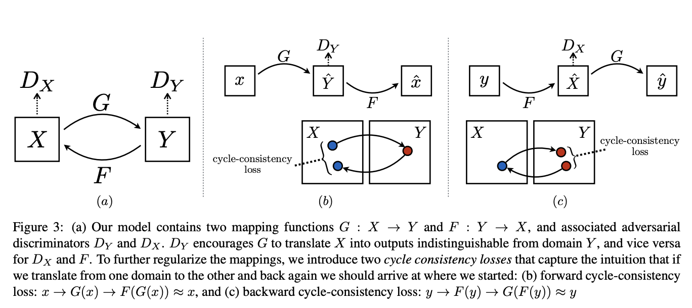
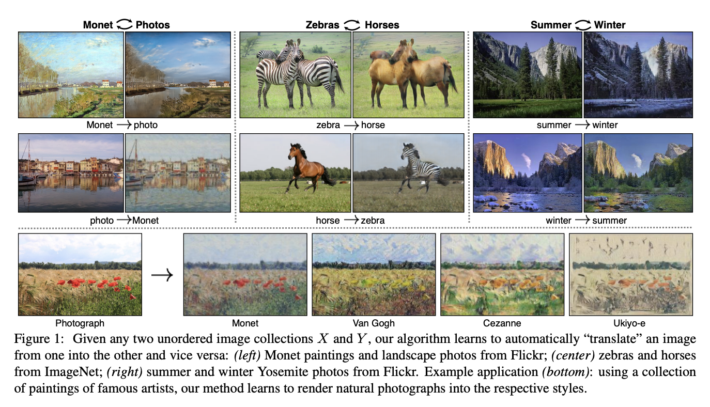

# CycleGAN for GTA5 to CityScapes Domain Translation

This repository contains my personal project to create an unpaired domain translation module using CycleGAN that can translate outdoor scenes extracted from GTA5 dataset to actual images from cityscapes dataset and viceversa. Such module can then be used to tackle the scarcity of high quality and inclusive outdoor data in tasks like semantic segementation. 


## Table of Contents

- [Overview](#overview)
- [Details](#details)
- [Datasets](#datasets)
- [Results](#results)
- [References](#references)

## Overview

I am using CycleGAN for domain translation. Here is an abstract from the famous paper. The paper can be found [here](https://arxiv.org/abs/1703.10593)
Image-to-image translation is a class of vision and graphics problems where the goal is to learn the mapping between an input image and an output image using a training set of aligned image pairs. However, for many tasks, paired training data will not be available. We present an approach for learning to translate an image from a source domain X to a target domain Y in the absence of paired examples. Our goal is to learn a mapping G:X→Y such that the distribution of images from G(X) is indistinguishable from the distribution Y using an adversarial loss. Because this mapping is highly under-constrained, we couple it with an inverse mapping F:Y→X and introduce a cycle consistency loss to push F(G(X))≈X (and vice versa). Qualitative results are presented on several tasks where paired training data does not exist, including collection style transfer, object transfiguration, season transfer, photo enhancement, etc. Quantitative comparisons against several prior methods demonstrate the superiority of our approach.

## Details




Here are some of the results obtained in the original paper.


## Datasets

I am using the GTA5 and CityScapes Dataset for translation. The dataset can be downloaded [here](http://efrosgans.eecs.berkeley.edu/cyclegta/cityscapes2gta.zip)

## Results

To be updated soon

## References
```
@inproceedings{CycleGAN2017,
  title={Unpaired Image-to-Image Translation using Cycle-Consistent Adversarial Networks},
  author={Zhu, Jun-Yan and Park, Taesung and Isola, Phillip and Efros, Alexei A},
  booktitle={Computer Vision (ICCV), 2017 IEEE International Conference on},
  year={2017}
}


@inproceedings{isola2017image,
  title={Image-to-Image Translation with Conditional Adversarial Networks},
  author={Isola, Phillip and Zhu, Jun-Yan and Zhou, Tinghui and Efros, Alexei A},
  booktitle={Computer Vision and Pattern Recognition (CVPR), 2017 IEEE Conference on},
  year={2017}
}
```
