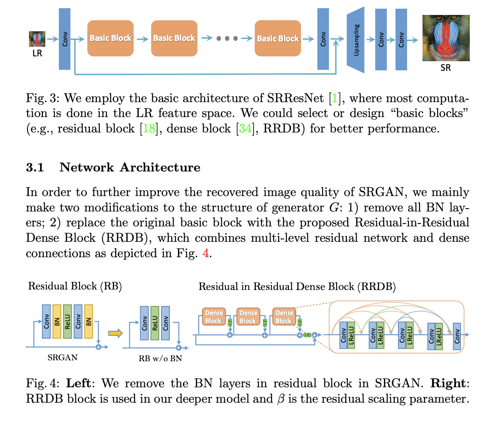
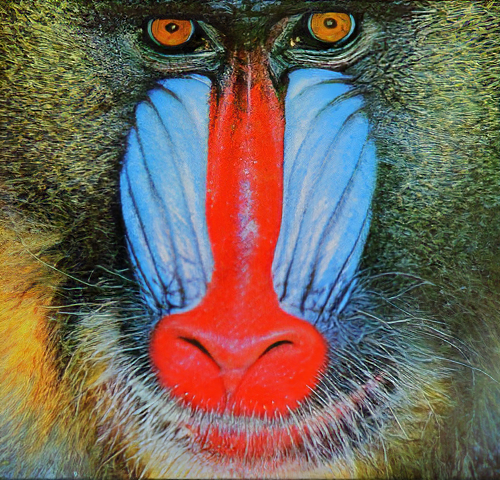
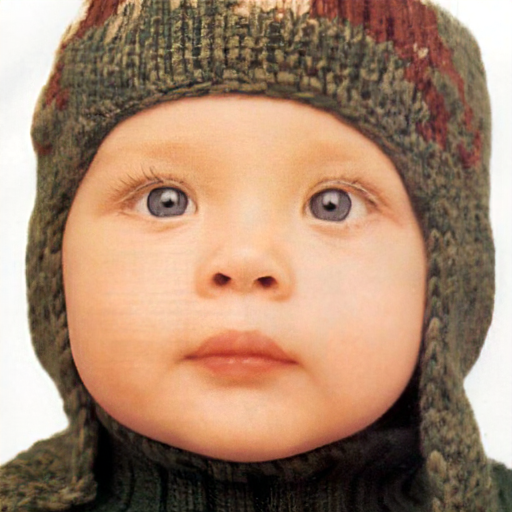

# Custom ESRGAN Implementation

This repository contains my custom implementation of the Enhanced SuperResolution GAN (ESRGAN). ESRGAN is a development of SRGAN, focusing on generating even higher-quality super-resolved images.


## Table of Contents

- [Overview](#overview)
- [Details](#details)
- [Results](#results)
- [References](#references)

## Overview

Here is the abstract presented by the authors in the paper. The paper can be found [here](https://arxiv.org/abs/1809.00219)

The Super-Resolution Generative Adversarial Network (SRGAN) is a seminal work that is capable of generating realistic textures
during single image super-resolution. However, the hallucinated details
are often accompanied with unpleasant artifacts. To further enhance the
visual quality, we thoroughly study three key components of SRGAN –
network architecture, adversarial loss and perceptual loss, and improve
each of them to derive an Enhanced SRGAN (ESRGAN). In particular, we introduce the Residual-in-Residual Dense Block (RRDB) without
batch normalization as the basic network building unit. Moreover, we
borrow the idea from relativistic GAN to let the discriminator predict
relative realness instead of the absolute value. Finally, we improve the
perceptual loss by using the features before activation, which could provide stronger supervision for brightness consistency and texture recovery.
Benefiting from these improvements, the proposed ESRGAN achieves
consistently better visual quality with more realistic and natural textures
than SRGAN and won the first place in the PIRM2018-SR Challenge1

## Details



## Results

Here are some of the results obtained

<table>
    <tr>
        <td></td>
        <td></td>
        <td></td>
    </tr>
</table>

The results presented were obtained by loading a pretrained model

## References
```
@InProceedings {wang2018esrgan,
    author = {Wang, Xintao and Yu, Ke and Wu, Shixiang and Gu, Jinjin and Liu, Yihao and Dong, Chao and Qiao, Yu and Loy, Chen Change},
    title = {ESRGAN: Enhanced super-resolution generative adversarial networks},
    booktitle = {The European Conference on Computer Vision Workshops (ECCVW)},
    month = {September},
    year = {2018}
}
```
