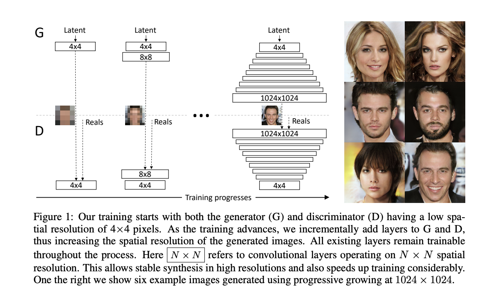

# Custom ProGAN Implementation

This repository contains my custom implementation of the Progressive GAN (ProGAN) with tailored modifications in hyperparameters (because I don't have superfast GPUs). ProGAN is renowned for its progressive training strategy that enables the generation of high-resolution images with remarkable quality.

## Table of Contents

- [Overview](#overview)
- [Details](#details)
- [Dataset](#dataset)
- [Results](#results)
- [References](#references)

## Overview

The paper can be found [here](https://arxiv.org/abs/1710.10196)

The authors describe a new training methodology for generative adversarial networks. The key idea is to grow both the generator and discriminator progressively: starting from a low resolution, they add new layers that model increasingly fine details as training progresses. This both speeds the training up and greatly stabilizes it, allowing us to produce images of unprecedented quality, e.g., CelebA images at 1024^2. They also propose a simple way to increase the variation in generated images, and achieve a record inception score of 8.80 in unsupervised CIFAR10. Additionally, they describe several implementation details that are important for discouraging unhealthy competition between the generator and discriminator. Finally, they suggest a new metric for evaluating GAN results, both in terms of image quality and variation. As an additional contribution, they construct a higher-quality version of the CelebA dataset.

## Details



## Dataset

The dataset can be obtained [here](https://www.kaggle.com/lamsimon/celebahq)

## Results

Here are some of the results obtained


Some additional computational resources, and some hyperparameter tuning, might improve the quality of results obtained.

## References
```
@misc{karras2018progressive,
      title={Progressive Growing of GANs for Improved Quality, Stability, and Variation}, 
      author={Tero Karras and Timo Aila and Samuli Laine and Jaakko Lehtinen},
      year={2018},
      eprint={1710.10196},
      archivePrefix={arXiv},
      primaryClass={cs.NE}
}
```

