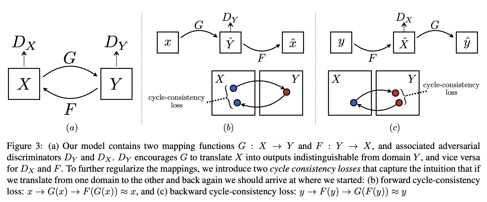
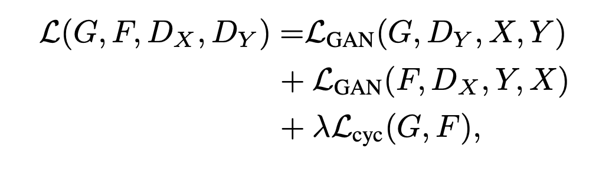
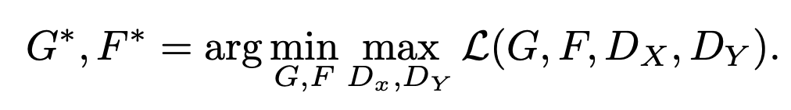

### Overview

This repository contains my submission for the Dashtoon Fresher Hiring Assignment for the Generative AI Stream. The task was to "to create a deep learning model capable of adapting an existing work to resemble the aesthetic of any art. The model should be able to analyze the artistic style of the selected art and apply similar stylistic features to a new, original artwork, creating a piece that seems as though it could have been created by the artist themselves."
I classified this problem as that of image-to-image translation where the goal is to learn the mapping between an input image and an output image using a training set of aligned image pairs.
However, for many tasks, paired training data will not be available. The authors present an approach for learning to translate an image from a source domain X to a target domain Y in the absence of paired examples. The goal is to learn a mapping G:X→Y such that the distribution of images from G(X) is indistinguishable from the distribution Y using an adversarial loss. Because this mapping is highly under-constrained, it has to be coupled with an inverse mapping F:Y→X and introduce a cycle consistency loss to push F(G(X))≈X (and vice versa). 

### Table of Contents

- [Model Architecture](#model-architecture)
- [Objective](#objective)
- [Dataset](#dataset)
- [Training](#training)
- [Style Adaptation](#style-adaptation)
- [Evaluation](#evaluation)
- [Deliverables](#deliverables)

### Model  Architecture

I decided to use CycleGAN [(Zhu et. al, 2017)](https://arxiv.org/pdf/1703.10593) for this task which is a novel method for unpaired image-to-image translation. One of the main reasons for choosing this method is that the algorithm doesn't require paired images.
Now, my goal is to learn to convert photographs to look as though painted by some artist and imitate their artistic style. Let's say X is the set of photographs in consideration and
Y is the set of images pertaining to the artist's style ( I have chosen Vangogh here). Then the aim is to learn a mapping G: X → Y such that the distribution of images from G(X) is indistinguishable from the distribution Y using an adversarial loss.
Because this mapping is highly under-constrained, we couple it with an inverse mapping F : Y → X and introduce a cycle consistency loss to enforce F(G(X)) ≈ X (and vice versa).

* For the Generator, the authors used a ResNet-based architecture, but I used the standard UNet architecture because it helps to capture fine details.
* For the discriminator, I am following the architecture used by the authors.

### Objective

The total objective of the algorithm is as follows:

 

where the GAN components represent the adversarial losses for the respective generators and there is an additional cycle consistency loss.
Now, the objective is to find the optimal paramteters for generators for both the generators by backpropagation.

 

### Dataset

* The dataset can be found [here](http://efrosgans.eecs.berkeley.edu/cyclegan/datasets/vangogh2photo.zip).
* It contains roughly 6000 images each for both domains in the training set, and roughly 2000 images each in the test set.

### Training

I chose the following set of hyperparameters for training.
* Learning rate - 0.001
* Batch size - 4
* Lambda_identity - 5 (The relative weight of identity loss in the total loss)
* Lambda_cycle - 10 (The relative weight of the cycle-consistency loss in the total loss)
* Epochs - 100

